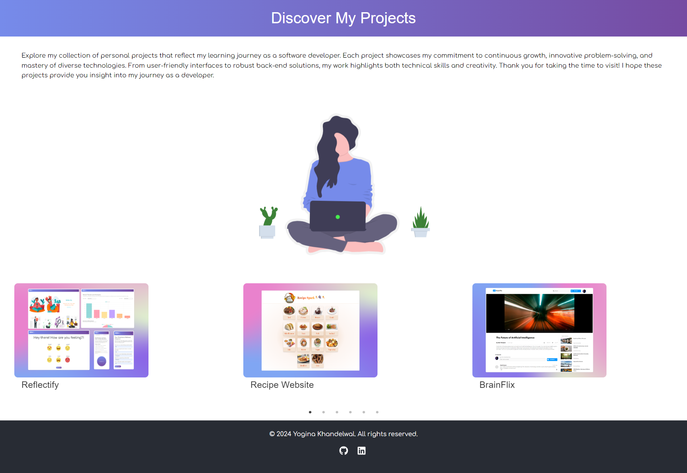
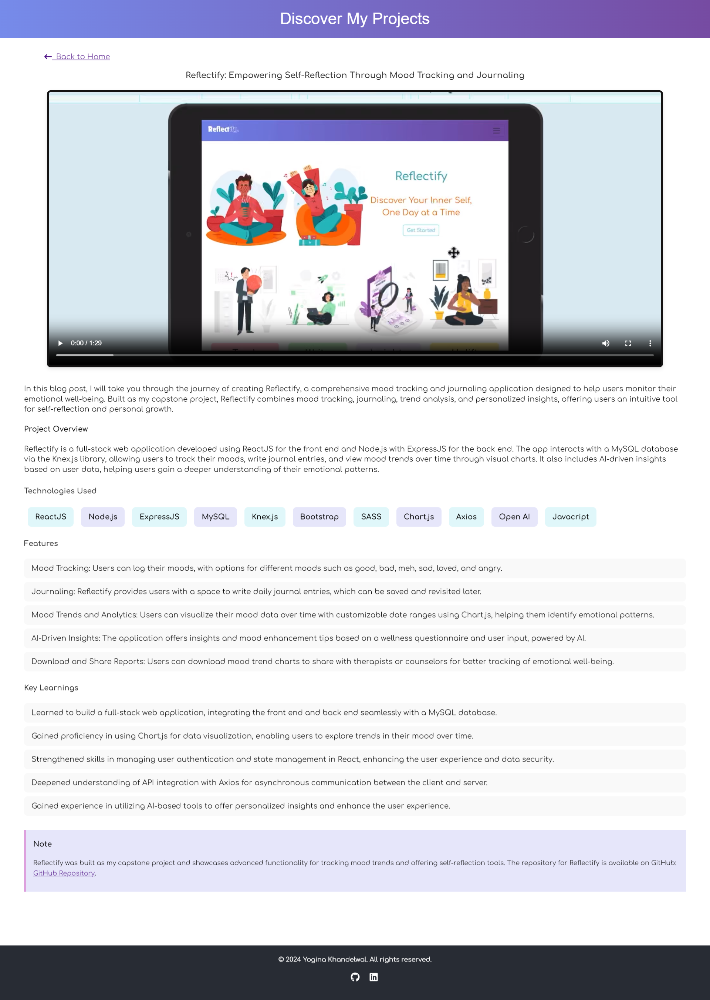

# Blogs
 It is a responsive platform designed to display my various projects and demos. This application serves as a digital portfolio, allowing users to explore my work, understand my design process, and engage with the showcased content. Built as a personal initiative, the Blogs application aims to highlight my journey as a developer.

## The site is live at- 
https://yoginak.github.io/Blogs/

- Here are some images from the web application:




## Installation

### Prerequisites

- **Node.js** (v14 or above)
- **npm** or **yarn**

### Steps to Set Up

1. **Clone the repository**:
    ```bash
    git clone https://github.com/your-username/Recipe-Website.git
    ```

2. **Navigate to the project directory**:
    ```bash
    cd Recipe-Website
    ```

3. **Install the dependencies**:
    ```bash
    npm install
    ```
    or
    ```bash
    yarn install
    ```

4. **Run the development server**:
    ```bash
    npm start
    ```
    or
    ```bash
    yarn start
    ```